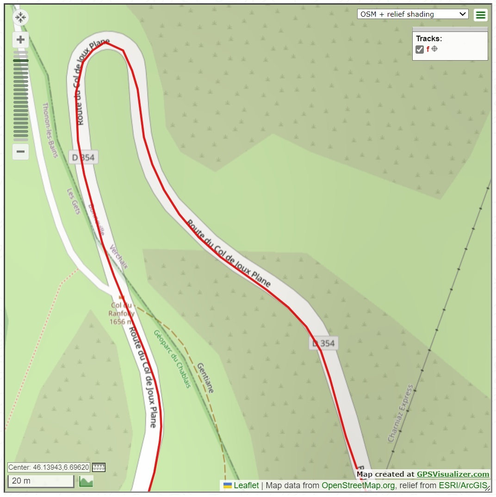

MorphSat - Morphism through constraint Satisfation V0.14

Eric Christoffersen - 2024.

This is a command line tool for arbitrary manipulation of workout files.
This project is currently private and not open source.

This project makes use of or has source code derived from the following sources:
- david eberly's geometric tools: https://github.com/davideberly/GeometricTools
- google or-tools               : https://github.com/google/or-tools
- vince's csv parser            : https://github.com/vincentlaucsb/csv-parser
- garmin fit sdk                : https://developer.garmin.com/fit/overview
- rapidxml project              : https://sourceforge.net/projects/rapidxml
- rapidjson project             : https://github.com/Tencent/rapidjson

Current state:

  -- File Type Support:
       Current file type support for READ and WRITE:

         CSV  - READ WRITE

         JSON - READ WRITE - in the style of golden cheetah

         GPX  - READ WRITE

         FIT  - READ WRITE

         RLV  - READ WRITE

         PGMF - READ WRITE

         TTS  - READ

     Example: to write out a tts as csv do:

       morphsat.exe -i t.tts -o t.csv

  -- Compare command:

       To quickly compare semantic of files:

        morphsat.exe -i f.pgmf -i f.rlv -c

          read file:    f.pgmf     0: F.pgmf - 1970-01-01T00:00:00Z (27842)     202440m                   0s
          read file:     f.rlv     1:  f.rlv - 1970-01-01T00:00:01Z (27842)     202460m               27840s
          Comparing WorkoutFiles:
               0: f.pgmf - 1970-01-01T00:00:00Z (27842)     202440m                   0s
               1:  f.rlv - 1970-01-01T00:00:01Z (27842)     202460m               27840s
          Available Field Comparison
                                  0  |      1
                Grade:          All  |   None
                Watts:         None  |   None
             Distance:          All  |    All
                  Lat:         None  |   None
                  Lon:         None  |   None
                  Alt:          All  |   None
                Speed:         None  |    All
                   HR:         None  |   None
                 Time:         None  |   None
            MediaTime:         None  |    All
                 Temp:         None  |   None
              Cadence:         None  |   None

  -- Merge command:

       Interpolating merge.

       First file input (-i) is considered the merge primary. All subsequent files are merged
       onto the primary using a common basis.

       If both files have time then time is used, otherwise if both files have time then time
       is used.

       If time or distance cannot be used as a common basis then the secondary file is resampled
       to match primary point count, then values are copied across.

       Fields that exist in the primary will not be overwritten, with exception of Altitude:
         if primary has altitude and not location, and other has location and altitude, then
         location and altitude will be interpolated onto primary. Is assumed that altitude
         in primary was derived from gradient.

       Example:

        To merge a gpx track onto a time/gradient tts file, and output the combined data
        as a json, you can do:

          morphsat.exe -i f.tts -i f.gpx -merge -o f.json

            read file:     f.tts     0:  f.tts - 1970-01-01T00:00:00Z (1124)    54050.7m                6780s
            read file:     f.gpx     1:  f.gpx - 1970-01-01T00:00:00Z (8412)      53624m                   0s
              INTERPOLATING MERGE of data from file 1 onto data from file 0 - SUCCESS
            file written: f.json     0: f.json - 1970-01-01T00:00:00Z (1124)    54050.7m (   100%)      6780s(   100%)

          morphsat.exe -i f.tts -i f.gpx -i f.json -c

            read file:     f.tts     0:  f.tts - 1970-01-01T00:00:00Z (1124)    54050.7m                6780s
            read file:     f.gpx     1:  f.gpx - 1970-01-01T00:00:00Z (8412)      53624m                   0s
            read file:    f.json     2: f.json - 1970-01-01T00:00:00Z (1124)    54050.7m                6780s
            Comparing WorkoutFiles:
                 0:  f.tts - 1970-01-01T00:00:00Z (1124)    54050.7m                6780s
                 1:  f.gpx - 1970-01-01T00:00:00Z (8412)      53624m                   0s
                 2: f.json - 1970-01-01T00:00:00Z (1124)    54050.7m                6780s
            Available Field Comparison
                                    0  |      1  |      2
                  Grade:          All  |   None  |   None
                  Watts:         None  |   None  |   None
               Distance:          All  |    All  |    All
                    Lat:         None  |    All  |    All
                    Lon:         None  |    All  |    All
                    Alt:          All  |    All  |    All
                  Speed:         None  |   None  |   None
                     HR:         None  |   None  |   None
                   Time:          All  |   None  |   None
              MediaTime:          All  |   None  |    All
                   Temp:         None  |   None  |   None
                Cadence:         None  |   None  |   None

              track point count difference comparing 0 and 1:-7288

  -- Resample command:

       Resamples all input files with given number of samples.
       By default uses time as basis. Uses distance as basis if
       time isn't available.

        morphsat.exe -i f.tts -stats

          read file:    f.tts     0: t.tts - 1970-01-01T00:00:00Z (27842)     202440m             27840.9s

        morthsat.exe -i f.tts -resample 10000 -o f10k.rlv

        morphsat.exe -i f.tts -i f10k.rlv -c

          read file:                   f.tts     0:                f.tts - 1970-01-01T00:00:00Z (27842)     202440m             27840.9s
          read file:                f10k.rlv     1:             f10k.rlv - 1970-01-01T00:00:02Z (10000)     202427m             27839.4s
          Comparing WorkoutFiles:
               0: F_RDGA2012-Part3.tts - 1970-01-01T00:00:00Z (27842)     202440m             27840.9s
               1:             f10k.rlv - 1970-01-01T00:00:02Z (10000)     202427m             27839.4s
          Available Field Comparison
                                  0  |      1
                Grade:          All  |   None
                Watts:         None  |   None
             Distance:          All  |    All
                  Lat:          All  |   None
                  Lon:          All  |   None
                  Alt:          All  |   None
                Speed:         None  |    All
                   HR:         None  |   None
                 Time:          All  |   None
            MediaTime:          All  |    All
                 Temp:         None  |   None
              Cadence:         None  |   None

            track point count difference comparing 0 and 1:17842

Example of how resampling changes gps route:

Here's a piece of a route from an original tts:

Same location downsampled from 27842 samples to 10000 samples.

And same location again after upsampling 10k sample up to 40k samples:

Point here is that if you throw away data by downsampling it likely won't be recovered...

Future Stuffs:

   Rescale distance and/or time within regions of loaded file, this can be used to synchronize workout tracks with video.

   Various smoothing and outlier removal.

   Calculate and print workout statistics.
